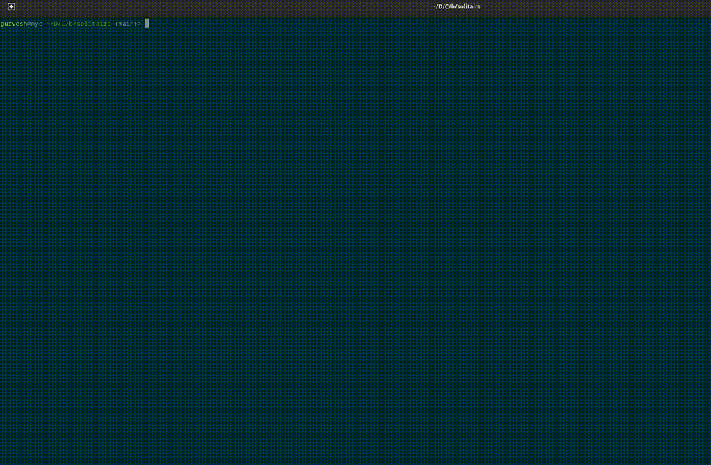

# Peg Solitaire Game

An implementation the classic Peg Solitaire game using Python's Tkinter library for the GUI and Julia for the solver.

This is my first project for the [Boot.dev](https://boot.dev) course on Python.

Includes a graphical interface to play the game, as well as a solver that can find solutions to the game using depth-first search (DFS).

 of the game in action.

## Rules of Peg Solitaire
- The game is played on a board with pegs arranged in a cross shape, with one starting empty space in the centre.
- The objective is to remove as many pegs as you can by jumping over them.
- A peg can jump over an adjacent peg (left, right, up or down) into an empty space immediately next to the jumped peg, removing the jumped peg from the board.
- Ideally, at the end only 1 peg should remain on the board at the end.

## Features
- Play Peg Solitaire with a graphical interface
- Solve the game using a Julia-based solver (DFS with rotation and reflection symmetry to cut down on search space)
- Go back and forward through the move history using arrow-keys (forward moves are always animated)
- Reset the game to the initial state
- Show hints for the next move
- Animated solution display

## Get Started
1. Clone the repository
2. You have 2 options. 
    (a) Create a virtual environment and install the required packages.
    - You need Python 3.8 or later.
    - Install the required packages using `pip install -r requirements.txt`.
    - Use the command `python -m main` to run the game.

    (b) Use `uv` to run the game directly. 
    - Assuming you have `uv` installed, you can run the game using the command `uv run --with numpy --with juliacall main.py`

## How to Play
- Click on a peg to select it, then **drag** it to the destination peg. You can only drag the peg to a valid destination.
- The game is won when only one peg remains on the board.
- Use the arrow keys *Left arrow* and *Right arrow* to navigate through the move history. *Left arrow* will go back to the previous move, and *Right arrow* will go forward to the next move.
- Use the **Reset** button to reset the game to the initial state.
- Use the **Hint** button to get a hint for the next move. Note that after the hint is shown, the game will reset to the initial state after a short delay (to allow you to see the hint).
- Use the **Solve** button to solve the game using the Julia-based solver. The solution. The solution will then be animated.
- Use the Left and Right arrow keys to go back and forward through the move history.
- Keep an eye on the console for the solver's output, which will show the best solution found and the number of moves made to find it, and the number of unique boards seen.
- Change the animation speed by modifying the `ANIMATION_SPEED` constant in `constants.py`, and restarting the game. The default speed is 25 pixels per frame.

### Why Julia?
The solver is implemented in Julia for its performance and ease of use with mathematical operations. Julia's speed makes it suitable for solving the game **a lot more** efficiently than Python.

The solver is also implemented in Python, and if you see the `SolSolver` directory SolSolver.jl` is very close to the Python implementation in the file `Board.py`.

The Julia implementation is 10-100x faster though.

#### Some other reasons for Julia (if you're so inclined):
- DFS can run into issues if the solution is not found quickly. There is an implicit ordering of the search space through the listing of the possible moves, so that while the solver can find a solution very quickly if starting from the Solitaire board (due to its symmetry, about 26,728 moves only - Julia can do this in under 0.05s on the 2nd try), it can take a much longer time if starting from a random board (the maximum I saw exceeded 14 million moves with >9 million unique boards seen).

- Julia can still solve this in a few seconds, but Python couldn't get there even in 10 mins (I gave up after that). I thought there was a bug in the code leading to infinite looping (a couple of wasted evenings trying to track it down), but it was just that Python's performance is not as good as Julia's for this kind of problem.

- There may be other solutions to this problem (e.g. rotating the board so that the implicit move prioritisation is more efficient), but as soon as I saw that Julia can be called from Python, I decided to use it for the solver. *I had solved this problem in Julia first*, and then ported it to Python. So it was quite easy to call the Julia code from Python, once I realised it was possible to do so.

- As they say *With great tools comes the urge to use them*

- Shout out to JuliaCall for making it easy to call Julia code from Python. It is a great package that allows you to call Julia code from Python seamlessly. And for this thread from the developer of Juliacall which showed directly how to make it work. [julialang.org](https://discourse.julialang.org/t/calling-julia-from-python-with-juliacall/100626/2)

### Known Issues
- The game does not currently support saving and loading games.
- Julia cold-start can be slightly slow. So the first time you ask the solver to solve a game, it may take a few seconds (5-6 seconds). Subsequent calls will be much faster (under 0.05 seconds on my computer from the initial board).
- If you mess around with the controls too much, the GUI can break. *This is a toy project.* I recommend resetting the game if this happens, or quitting and restarting the game.